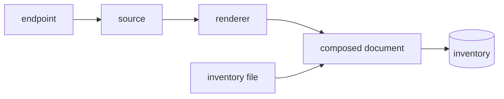

# How discovery composes the inventory

A site that already holds its device inventory in NetBox, a CMDB or a service discovery document should not maintain a second copy for riptide.
Discovery reads the `exporters` tree from that source on a schedule and merges it with the inventory file, so one device list serves both.
The keys are on the [Discovery reference](../reference/discovery.md); the procedures are the four `Discover exporters from ...` guides.

## Components

| Component | Responsibility | Talks to |
| --- | --- | --- |
| Source (`prometheus-sd`, `netbox-api`, `mapped-json`) | Fetches the endpoint and turns each answer into target groups | The endpoint, through the discovery client |
| Discovery client | One bounded HTTP read per page with the token resolved per request | Secret resolvers, the outbound trust store |
| Renderer | Turns target groups into exporter entries, skips and counts unusable ones, refuses collisions and empty results | The composed document |
| Composed inventory document | Merges the file's trees with the rendered exporters, refuses a file that carries its own `exporters` tree | The inventory loader and watcher |
| Inventory watcher | Re-reads the composed document every `riptide.discovery.interval` | The inventory |



## What discovery owns

Discovery owns the `exporters` tree.
The inventory file keeps owning `snmp.agents`, because agent ranges are a handful of CIDRs that gain nothing from per-device discovery, and because SNMP enrichment would otherwise stop the moment discovery was enabled.

No entry ever has two possible sources.
An `exporters` tree in the inventory file while `riptide.discovery.url` or `riptide.discovery.urls` is set is refused with a message naming the file and the key that enabled discovery, whether or not the endpoint can be reached.
The check runs on every merge of the file with the endpoint, at boot and on every later poll.

Discovery is off until `riptide.discovery.url` holds a non-blank value, or `riptide.discovery.urls` holds a non-blank entry.
A blank value, unset or whitespace-only, is treated exactly as no value: nothing discovery-related is created and the inventory file stays the only source of exporter entries.
That equivalence is deliberate.
A container image or a Helm template commonly exports every variable it knows about whether or not it has a value, and `RIPTIDE_DISCOVERY_URL=""` must not turn discovery on for an operator who never asked for it.
`RIPTIDE_DISCOVERY_URLS=""` follows the same rule: a list with no non-blank entry is unset.

### Decommissioning a fleet

The reloader refuses a file in which a previously populated tree is simply absent, because that is what a half-written file looks like.
To empty one on purpose you write it as an explicit empty mapping, and that still holds with discovery enabled.

Both spellings work: the narrow `riptide.snmp.agents: {}` and the broad `riptide: {}`.
The broad one declares everything the file still owns to be empty, which with discovery enabled means the agent ranges; the exporters keep coming from the endpoint, because the file does not own that tree any more.

The third form a file-only inventory accepts, `exporters: {}`, is not available here.
The file may not declare an exporters tree at all while discovery owns it, so writing one is refused rather than read as a decommission.

## Choosing a source

Three readers ship, and `riptide.discovery.type` picks between them.
One speaks the Prometheus HTTP service discovery format, which many systems emit and which is tied to no product.
One speaks NetBox's own device API.
One reads any JSON endpoint by paths you write.
NetBox is reachable by either of the first two, and neither is only for NetBox.
Unset means `prometheus-sd`, so an existing deployment is unaffected.

For NetBox, `netbox-api` is the reader to prefer: nothing is installed on the NetBox side, the walk follows pagination to completion, and `riptide.discovery.filter` is passed in NetBox's own query terms so a large inventory is not fetched whole on every poll.
`prometheus-sd` against the `netbox-plugin-prometheus-sd` endpoint is for a site that already runs the plugin and would rather not change a working integration; that endpoint disables pagination and supports no conditional requests, so every poll transfers every visible device.
So the plugin is a way to reach NetBox, not a requirement of the format: an operator who cannot install plugins is not shut out, and one who already runs it does not have to migrate.

For anything else, a home-grown asset database, a CMDB, or a DCIM that is not NetBox, `mapped-json` points at the endpoint you already serve and says which fields hold the name and the address, instead of running a service to translate one into a format riptide already knows.
Nautobot is in this group: it is a NetBox fork, but `netbox-api` cannot read it, because that source appends `ordering=id` and Nautobot rejects it with `HTTP 400 {"ordering":["Unknown filter field"]}` on every poll whatever the filter says.

## What a path is, and what it is not

A path is dotted field names and nothing more.
There are no transforms, defaults, conditionals, concatenation, indexing or wildcards, and no template or expression syntax.
Those were considered and rejected: an expression language fed from a configuration file is a code-execution surface, which is the thing riptide resolves every credential through a [secret reference](../reference/secret-references.md) to avoid.

A value is used as found, which means a value that is not usable cannot be made usable.
The case you are most likely to meet is an address served with host bits under a prefix length, `10.0.0.1/24`.
An exporter address is matched against the source address of a flow, so that cannot be used, and those devices are skipped and counted on `discovery.skipped` like any other unusable entry.
When nothing was usable for that reason, the failure says so: which path, which values, and that `netbox-api` exists for NetBox.
That is the case worth naming, because otherwise the only message is that the endpoint yielded nothing, which reads as a filter or permission mistake.
A fleet where only some devices carry a prefix publishes the rest and reports the skipped count on the gauge.

A network range is not this problem.
`10.0.0.0/24` with no host bits is a legal exporter entry, because the matcher is a prefix trie, and it is used as found.

## Composing several endpoints

`riptide.discovery.urls` lists several endpoints under one configuration.
NetBox serves devices at `/api/dcim/devices/` and virtual machines at `/api/virtualization/virtual-machines/`, so a fleet that mixes both needs two.
Every endpoint shares `type`, `filter`, `token`, `auth-scheme`, `mapping`, `interval` and `timeout`.

Each endpoint gets its own client and its own source.
Pagination, `ordering=id` for `netbox-api`, the same-origin check on `next`, and the 100,000-device and 10,000-page limits all apply per endpoint.
The token is resolved once per endpoint at startup and once per request after that.

A poll reads the endpoints one after the other, in the order they are listed, and stops at the first that fails.
The composition is all or nothing: every endpoint must answer and yield entries, or nothing from the poll is published.
Reading the rest after one failed would cost their timeouts for a result that cannot be published.
A poll takes up to the sum of every endpoint's page reads, each bounded by `riptide.discovery.timeout`.

Name and address collisions are checked once across every endpoint, so a device and a virtual machine that share a name collide exactly as two devices do.
With more than one endpoint, each claimant in the collision report is followed by the endpoint it came from.
The same name with the same address on two endpoints is one entry.
Emptiness is checked per endpoint, not on the merged result.
NetBox answers a token that cannot view an object type with an empty list, and a merged check would let a token that lost view permission on virtual machines drop every virtual machine exporter while the devices kept the document non-empty.
`discovery.skipped` is summed across endpoints.

| When | Result |
| --- | --- |
| Any endpoint fails after boot | The whole poll is refused, the last good inventory serves, and `inventory.reload.failures` counts one failure naming that endpoint. |
| Any endpoint answers 404 | Absence for the whole document: `inventory.reload.stale` reads 1, and one warning per episode names that endpoint. |
| Any endpoint is unreachable at boot | Boot degrades as one endpoint does: no discovered exporters from any endpoint, a warning naming the unreachable one, and `inventory.reload.stale` at 1 until every endpoint answers. |
| Any endpoint yields zero usable entries | Refused, naming every empty endpoint with its own skip count. |
| A name or address clash within or across endpoints | Refused, every clash named at once, each claimant with its endpoint. |

Only the first failing endpoint is named when several are down.
The poll after it recovers names the next one.

## How a target becomes an exporter

The exporter name comes from the `__meta_netbox_name` label when it is present, and otherwise from the target itself with any trailing port removed.

The address comes from the first label in `address-labels` that is present and parses as a strict address, the same parser the inventory loader uses for agent ranges.
A label present but malformed (`not-an-ip`) is skipped as if it were absent, and the next label in the list is tried.
When no label qualifies, the target itself is used as the address, but only if the target parses as a strict address too.
A NetBox device's target is its name, so that fallback never fires for NetBox and the entry is skipped instead.
That second-stage fallback is what makes non-NetBox producers work: generic service discovery puts a real address in the target, where NetBox puts a device name.
Every IP address NetBox's service discovery plugin emits already has its CIDR mask stripped, and `netbox-api` strips it itself.

An entry with a blank name, or with no address from either a label or the target, is never guessed at.
It is skipped and counted on `discovery.skipped`.
For `netbox-api`, a device with no name is dropped by the source before this step and is not counted; only address failures reach the gauge.
For `mapped-json`, a device missing either path is dropped; only a present but unusable address reaches the gauge.

Two entries carrying the same name and the same address collapse into one entry, because one device can appear in two service discovery roles.
Two entries carrying the same name with different addresses are refused, and every collision is named at once.
Two entries carrying different names with the same address are refused the same way.

`netbox-api` appends `ordering=id` unless the filter already carries an `ordering=` term, so a device added while the walk is in progress appends rather than shifting the pages still to be read.
Without a stable order an endpoint paging by offset can return one device twice and miss another.
`mapped-json` appends nothing of its own, because the endpoint is not NetBox and `ordering` may mean nothing there, or something else; an endpoint that pages needs its own ordering term in the filter.

## What gets refused

Riptide keeps the running inventory rather than publishing a doubtful one.

| Refused | Why |
| --- | --- |
| A response that parses but yields no entries | A filter typo or a permission change must not be able to wipe every exporter name. |
| Two devices with one name and different addresses | Exporter names are inventory keys, so a collision would silently drop every claimant but one. NetBox enforces device-name uniqueness per site, not globally, so two sites each holding a `sw1` is ordinary. |
| Two devices with different names and one address | An address is what a flow is matched on, so two entries sharing one with no observation domain are ambiguous. NetBox enforces uniqueness on device name, not on primary IP, so an HA pair or a virtual-chassis member pair sharing one primary IPv4 is ordinary. |
| A response that is not the document the source expects | A bare array where a NetBox page was expected, an envelope where a bare array was, a non-object entry, a non-string target or label value. The endpoint is named. |
| An `exporters` tree in the inventory file | No entry may have two sources. Checked on every merge. |
| A walk past 100,000 devices or 10,000 pages | An unbounded inventory read on every poll, or a `next` link that never ends. |
| A `next` link on another origin | The token is sent with every page and must not leave the origin it was configured for. |

The exact messages are in the [message table](../reference/discovery.md#messages).

A 404 is absence rather than failure: the last good inventory keeps serving, `inventory.reload.stale` goes to 1, and the log warns once per episode rather than on every poll.
A missing inventory file is absence too, exactly as it is with discovery off: the cycle is skipped, the log warns once, the last good inventory keeps serving, and `inventory.reload.failures` does not move.
That covers both a file deleted after boot and the window an `rm` plus `mv` replacement opens.
A file that is present but unreadable, a permission denial for example, stays a counted failure: an operator told to make a file reappear that is already there has been sent to the wrong place.

## How a failure names itself

With discovery on, the inventory is one document composed from the file and the endpoints, so failures name all of them:

```text
Inventory source /etc/riptide/inventory.yaml + https://netbox.example.com/api/dcim/devices/ carries problems in 1 entry:
```

With `riptide.discovery.urls` the endpoints follow the file in listed order: `<file> + <url1>, <url2>`.

"Source" rather than "file", and the same for the clauses that refer back to it later in a message.
Which half to look at is what the two names are for: a problem in an agent range is the file's, a problem in an exporter is the endpoint's, and the entry named in the line tells you which.
With discovery off the same failure reads `Inventory file /etc/riptide/inventory.yaml ...`, unchanged.
A stray or non-string key at the top level is reported under "the document root" on both paths, because with discovery on that root belongs to a composed document.

The remediation changes with the noun.
A message about a partly written document tells you to write the file atomically only when the document is a file; with discovery on it says the next poll composes it again, because no `mv` you run fixes a response that was read short.

## Startup with the endpoint down {/* #startup */}

An endpoint that cannot be reached at boot, a refused connection, a timeout, or a 404, does not fail startup.
Riptide warns and serves the inventory file's trees with no `exporters` tree at all.
A collector that refuses to start because NetBox is down is worse than one that starts without device names.

Every other discovery failure still fails boot: an endpoint that answers with something that is not the expected document, a name collision, an empty answer, and an `exporters` tree already present in the inventory file.
Those are configuration an operator has to see, not an endpoint that is temporarily down.

After boot, a poll that fails for any reason, unreachable or invalid, keeps the last good inventory serving; nothing publishes a partial or degraded document past boot.
The degraded boot document has no `exporters` key at all rather than an empty one, so if it ever reached a reload the regression guard would refuse it rather than drop every exporter name.

Healing a degraded boot needs a working reload schedule.
With `riptide.discovery.interval` at its default or any positive value, the watcher retries on that schedule, `inventory.reload.stale` reads 1 until the first successful poll publishes the discovered exporters, and the boot warning names that interval.
Set to zero or a negative duration, the watcher never starts at all: no reload is scheduled and no `inventory.reload.stale` gauge is even registered, so the boot warning tells the operator the exporters stay missing until a restart.

A main-config reload that rotates a credential heals it too, without a restart, because that path re-reads the endpoint on its own regardless of `riptide.discovery.interval`.
It heals it only while the endpoint is reachable: the rotation's rebuild reads the endpoint strictly, so with the endpoint still down the rebuild fails, the rotation is parked as pending, and nothing is published.
While a rotation is pending, that retry runs once per config reload cycle, so the endpoint is polled at `riptide.config.reload-interval` rather than at `riptide.discovery.interval`, and each attempt can take up to `riptide.discovery.timeout`.
A `riptide.config.reload-interval` of a few seconds therefore retries a down endpoint every few seconds until the rotation lands.
Nothing else does.

## Trade-offs

| Choice | Gained | Given up |
| --- | --- | --- |
| Discovery owns exporters only | SNMP enrichment keeps working the moment discovery is enabled; agent ranges stay a short file | A device's SNMP credential still needs an agent range in the file |
| Refuse an empty answer | A filter typo or a revoked token cannot wipe every exporter name | Emptying a fleet on purpose needs a filter that keeps at least one device, or discovery turned off |
| Paths, not expressions | No code-execution surface fed from configuration | A value the endpoint serves in the wrong shape cannot be fixed on riptide's side |
| Degrade at boot on an unreachable endpoint | The collector starts while NetBox is down | Flows carry no exporter names until the first successful poll |
| Token resolved per request | Rotation applies on the next page, no restart | One secret resolution per page of a walk |
| Several endpoints read in sequence, all or nothing | A deterministic first failure; no partial fleet is ever published | Poll duration grows with the endpoint count; one endpoint down holds back every other |
